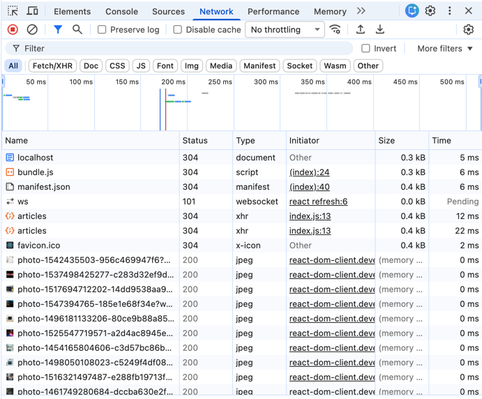
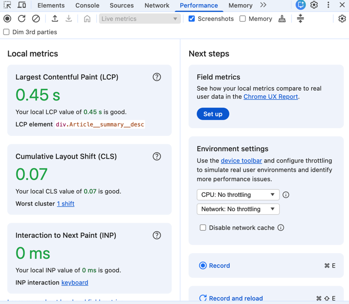
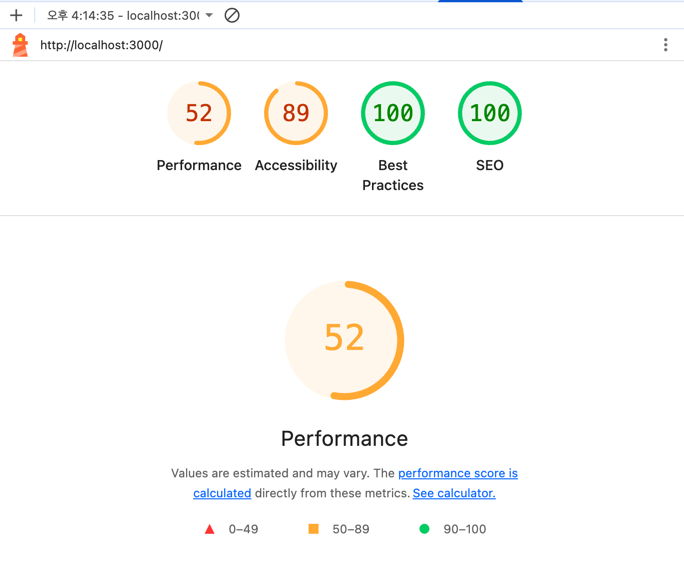
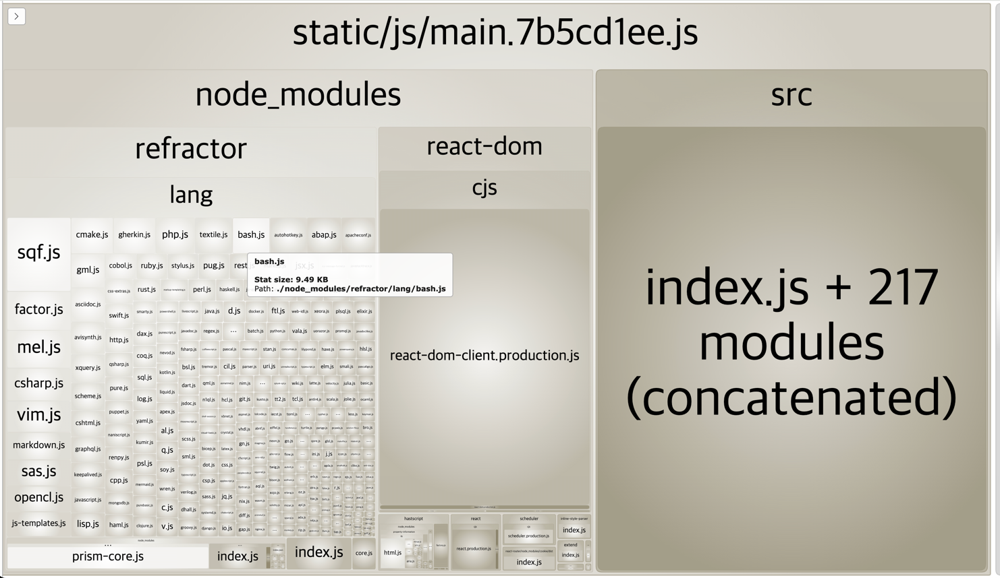
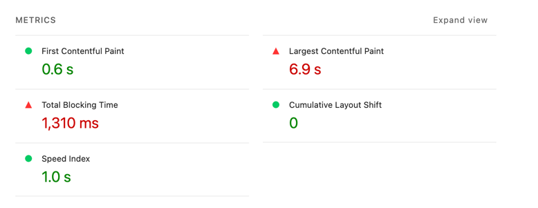
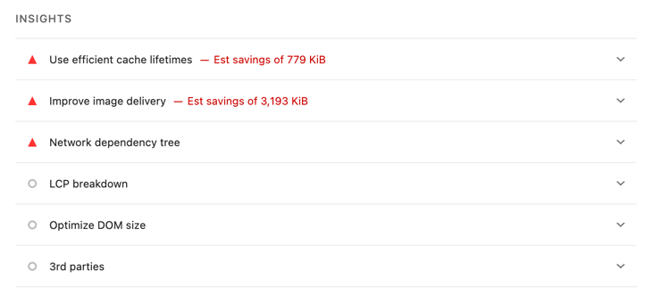
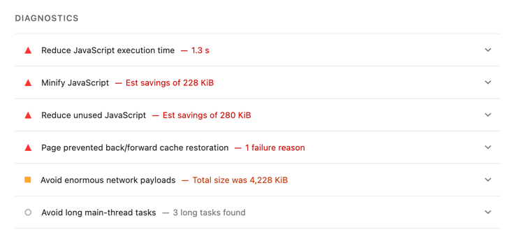
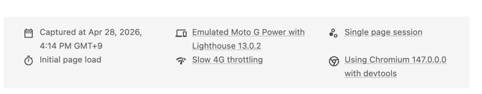
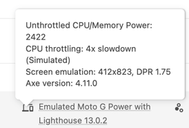
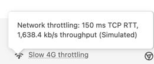

# 1장. 블로그 서비스 최적화

##  최적화 기법

### 이미지 사이즈 최적화
- 큰 사이즈의 이미지를 무분별 사용할 경우 네트워크 트래픽 증가로 서비스 로딩 속도가 느려집니다.  
- 그렇다고 이미지 사이즈를 무작정 줄이는 경우 이미지 화질 저하로 서비스 품질이 저하됩니다. 
- 적절한 이미지 사이즈를 찾아 성능을 높여야 합니다.  

### 코드 분할
- 코드 분할은 코드를 분할하는 기법입니다. 
- SPA의 특성상 모든 리액트 코드가 하나의 자바스크립트 파일로 번들링되어 로드되므로 첫 페이지 접속 시점시 당장 사용하지 않는 코드를 떼어 내고,
떼어낸 코드는 필요한 시점에 따라 로드할 수 있습니다.  

### 텍스트 압축
- HTML, CSS, JS가 포함된 리소스는 다운로드 전에 서버에서 미리 압축할 수 있습니다.
- 더 작은 사이즈로 다운로드 할 수 있어 웹 페이지가 더 빠르게 로드됩니다.

### 병목 코드 최적화
- 서비스를 느리게 만드는 코드인 병목 코드를 찾아내고 최적화합니다.

## 분석 툴

### 크롬 개발자 도구
- 크롬 브라우저에서 제공하는 웹 개발에 도움되는 다양한 툴입니다.

### 크롬 개발자 도구의 Network 패널
- 현재 웹 페이지에서 발생하는 모든 네트워크 트래픽을 상세하게 알려줍니다.

### 크롬 개발자 도구의 Performance 패널
- 웹 페이지가 로드될 때 실행되는 모든 작업을 보여줍니다.
- 리소스가 로드 되는 타이밍, 브라우저의 메인 스레드에서 실행되는 자바스크립트의 차트 형태
- 어떤 자바스크립트 코드가 느린지 확인할 수 있습니다.

### 크롬 개발자 도구의 Lighthouse 패널
- 웹사이트의 성능을 측정하고 개선 방향을 제시해 주는 자동화 툴입니다.

### webpack-bundle-analyer
- webpack을 통해 번들링된 파일이 어떤 라이브러리를 담고 있는지 보여줍니다.
- 해당 툴을 사용해 최종적으로 완성도니 번들 파일 중 불필요한 코드가 어떤 코드이고 번들 파일에서 어느 정도의 비중을 차지하는지 확인할 수 있습니다.

## LightHouse로 검사하기

### Mode
- Navigation: LightHouse의 기본 값으로 초기 페이지 로딩 시 발생하는 성능 문제를 분석합니다.
- Timespan: 사용자가 정의한 시간 동안 발생한 성능 문제를 분석합니다.
- Snapshot: 현재 상태의 성능 문제를 분석합니다.

### Categories
- Performance: 웹 페이지의 로딩 과정에서 발생하는 성능 문제를 분석합니다.
- Accessibility: 서비스의 사용자 접근성 문제를 분석합니다.
- Best practices: 웹 사이트의 보안 측면과 웹 개발의 최신 표준에 중점을 두고 분석합니다.
- SEO: 검색 엔진에서 얼마나 잘 크롤링되고 검색 결과에 표시되는지 분석합니다.
- Progressive Web App: 서비스 워커와 오프라인 동작 등, PWA와 관련된 문제를 분석합니다.

### Web vitals

### First Contentful Paint
- 페이지가 로드될 때 브라우저가 DOM 콘텐츠의 첫번째 부분을 렌더링 하는 데 걸리는 시간에 관한 지표입니다.
- 지표에서 첫 콘텐츠가 뜨기까지 0.6s가 걸렸음을 알 수 있습니다.

### Speed Index
- 페이지 로드 중에 콘텐츠가 시각적으로 표시되는 속도를 나타내는 지표입니다.

### Largest Contentful Paint
- 페이지가 로드될 때 화면 내에 있는 가장 큰 이미지나 텍스트 요소가 렌더링되기까지 걸리는 시간을 나타내는 지표입니다.
- 지표에서는 가장 큰 컨텐츠가 뜨기까지 6.9s가 걸렸음을 알 수 있습니다. 

### Time to Interactive(TTI)
- 사용자가 페이지와 상호 작용이 가능한 시점까지 걸리는 시간을 측정한 지표입니다.
- 상호 작용이란 클릭 또는 키보드 누름 같은 사용자 입력을 의미합니다. 

### Total Blocking Time(TBT)
- 페이지가 클릭, 키보드 입력 등의 사용자 입력에 응답하지 않도록 차단도니 시간을 종합한 지표입니다.
- FCP와 TTI 사이의 시간 동안 일어나며 메인 스레드를 독점하여 다른 동작을 방해하는 작업에 걸린 시간을 총합합니다.

### Cumulative Layout Shift
- 페이지 로드 과정에서 발생하는 예기치 못한 레이아웃 이동을 측정한 지표입니다.
- 레이아웃 이동은 화면상에서 요소의 위치나 크기가 순간적으로 변하는 것을 말합니다.

### Opportunities & Diagnostics

- Opportunites 섹션은 페이지를 더욱 발리 로드하는 데 잠재적으로 도움되는 제안을 나열합니다.

- Diagnostics 섹션은 성능과 관련된 기타 정보를 보여 줍니다.  

- 두 섹션을 통해 해당 서비스의 어느 부분을 개선해야 성능을 향상할 수 있는지 쉽게 파악할 수 있습니다.  

### Emulated Desktop & Slow 4G throttling
  

- Emulated Desktop 추가 정보에는 CPU throttling이라는 정보를 확인할 수 있는데, 이 정보는 컴퓨터의 CPU 성능을 어느 정도 제한하여 검사를 진행했는지 나타냅니다.  

- Network throttling은 네트워크 속도를 제한하여 어느 정도 고정된 네트워크 환경에서 성능을 측정했다는 것을 의미합니다.